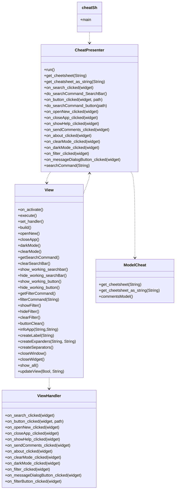
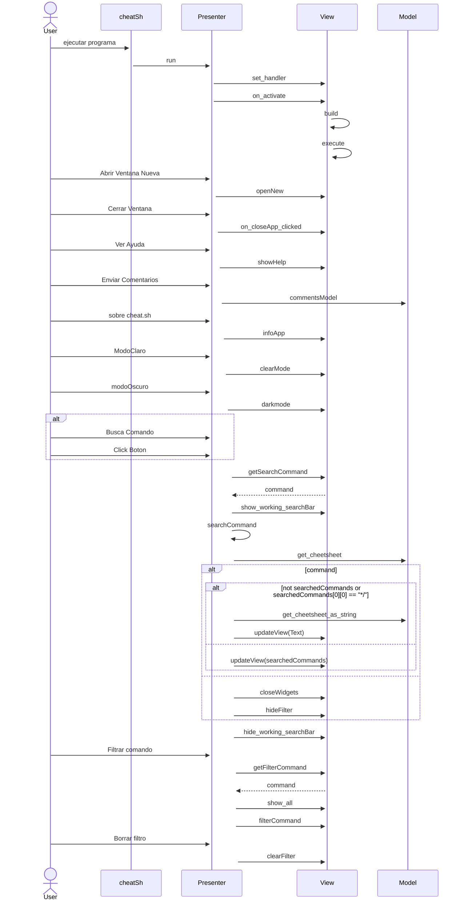

# DIAGRAMA DE CLASES

```mermaid
   classDiagram
    cheatSh..> CheatPresenter
    View ..> CheatPresenter
    View ..> ViewHandler
    CheatPresenter..>View
    CheatPresenter ..> ModelCheat
    
    class cheatSh{
        +main
    }
    class CheatPresenter{
    +run()
    +get_cheetsheet(String)
    +get_cheatsheet_as_string(String)
    +on_search_clicked(widget)
    +do_searchCommand_SearchBar()
    +on_button_clicked(widget, path)
    +do_searchCommand_button(path)
    +on_openNew_clicked(widget)
    +on_closeApp_clicked(widget)
    +on_showHelp_clicked(widget)
    +on_sendComments_clicked(widget)
    +on_about_clicked(widget)
    +on_clearMode_clicked(widget)
    +on_darkMode_clicked(widget)
    +on_filter_clicked(widget)
    +on_messageDialogButton_clicked(widget)
    +searchCommand(String)
    }
    class ModelCheat{
    +get_cheetsheet(String)
    +get_cheetsheet_as_string(String)
    +commentsModel()
    }
    class View{
    +on_activate()
    +execute()
    +set_handler()
    +build()
    +openNew()
    +closeApp()
    +darkMode()
    +clearMode()
    +getSearchCommand()
    +clearSearchBar()
    +show_working_searchbar()
    +hide_working_searchBar()
    +show_working_button()
    +hide_working_button()
    +getFilterCommand()
    +filterCommand(String)
    +showFilter()
    +hideFilter()
    +clearFilter()
    +buttonClean()
    +infoApp(String,String)
    +createLabel(String)
    +createExpanders(String, String)
    +createSeparators()
    +closeWindow()
    +closeWidget()
    +show_all()
    +updateView(Bool, String)
    }
    class ViewHandler{
    +on_search_clicked(widget)
    +on_button_clicked(widget, path)
    +on_openNew_clicked(widget)
    +on_closeApp_clicked(widget)
    +on_showHelp_clicked(widget)
    +on_sendComments_clicked(widget)
    +on_about_clicked(widget)
    +on_clearMode_clicked(widget)
    +on_darkMode_clicked(widget)
    +on_filter_clicked(widget)
    +on_messageDialogButton_clicked(widget)
    +on_filterButton_clicked(widget)
    }
```

# DIAGRAMA DE SECUENCIA

```mermaid
sequenceDiagram
    actor User
    User->>+cheatSh:ejecutar programa
    cheatSh->>+Presenter:run
    Presenter->>+View:set_handler
    Presenter->>+View:on_activate
    View->>+View:build
    View->>+View:execute
    User->>+Presenter:Abrir Ventana Nueva
    Presenter->>+View:openNew
    User->>+Presenter:Cerrar Ventana
    Presenter->>+View:on_closeApp_clicked
    User->>+Presenter:Ver Ayuda
    Presenter->>+View:showHelp
    User->>+Presenter:Enviar Comentarios
    Presenter->>+Model:commentsModel
    User->>+Presenter:sobre cheat.sh
    Presenter->>+View:infoApp
    User->>+Presenter:ModoClaro
    Presenter->>+View:clearMode
    User->>+Presenter:modoOscuro
    Presenter->>+View:darkmode
    alt 
    User->>+Presenter:Busca Comando
    User->>+Presenter:Click Boton
    end
    Presenter->>+View:getSearchCommand
    View-->>Presenter:command
    Presenter->>+View:show_working_searchBar
    Presenter->>+Presenter:searchCommand
    Presenter->>+Model:get_cheetsheet
    alt command
    alt not searchedCommands or searchedCommands[0][0] == "*/"
    Presenter->>+Model:get_cheetsheet_as_string
    Presenter->>+View:updateView(Text)
    else 
    Presenter->>+View:updateView(searchedCommands)
    end
    else
    Presenter->>+View:closeWidgets
    Presenter->>+View:hideFilter
    end
    Presenter->>+View:hide_working_searchBar

    User->>+Presenter:Filtrar comando
    Presenter->>+View:getFilterCommand
    View-->>Presenter:command
    Presenter->>+View:show_all
    Presenter->>+View:filterCommand

    User->>+Presenter:Borrar filtro
    Presenter->>+View:clearFilter


    
```

